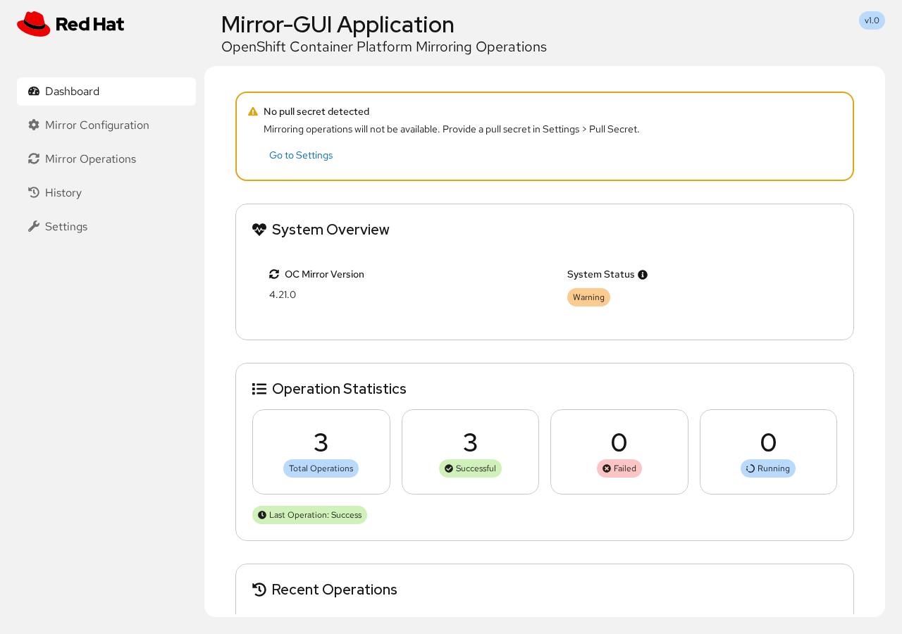
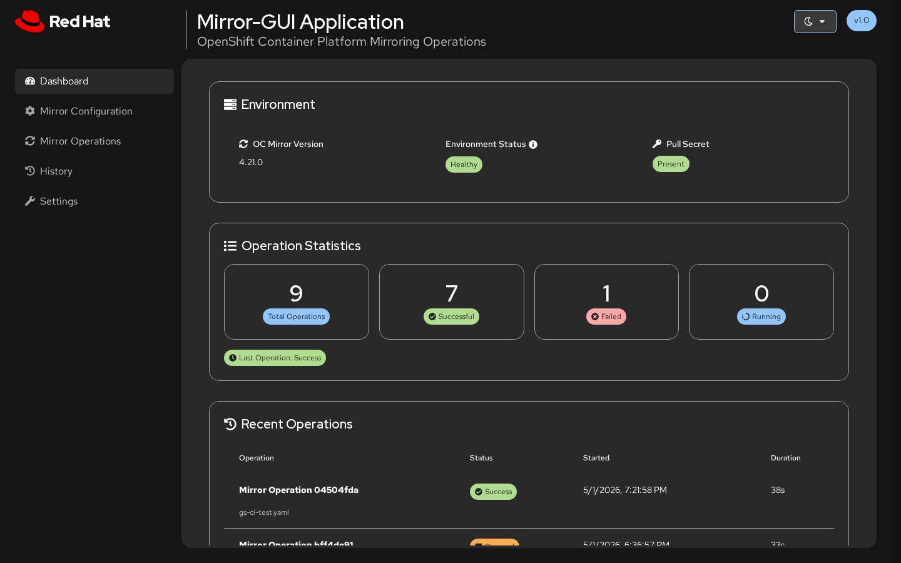
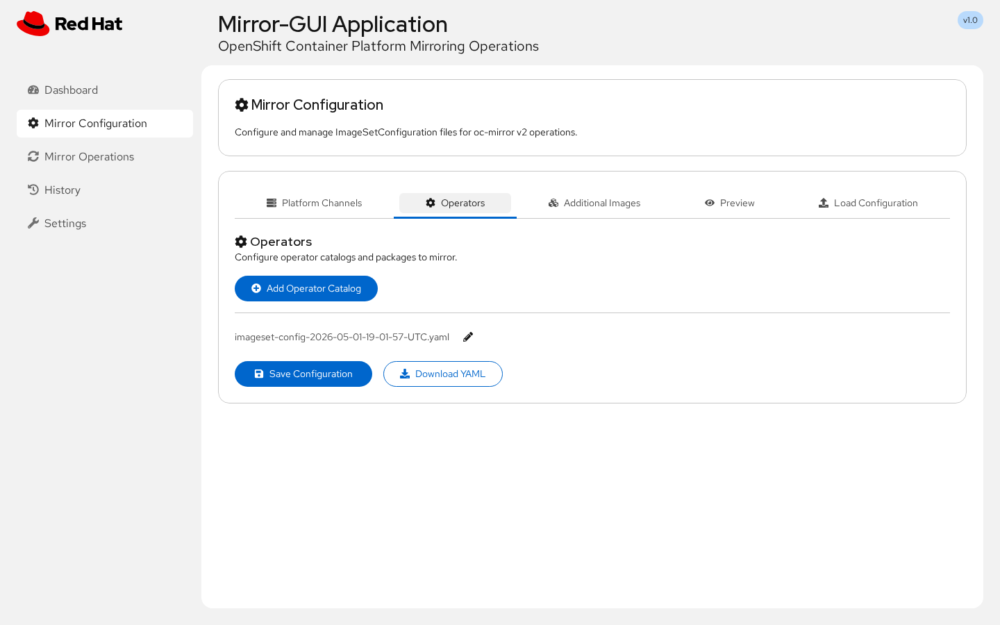
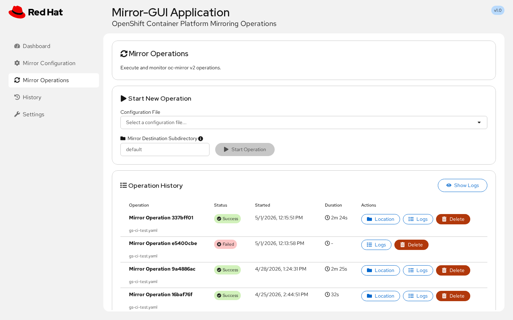
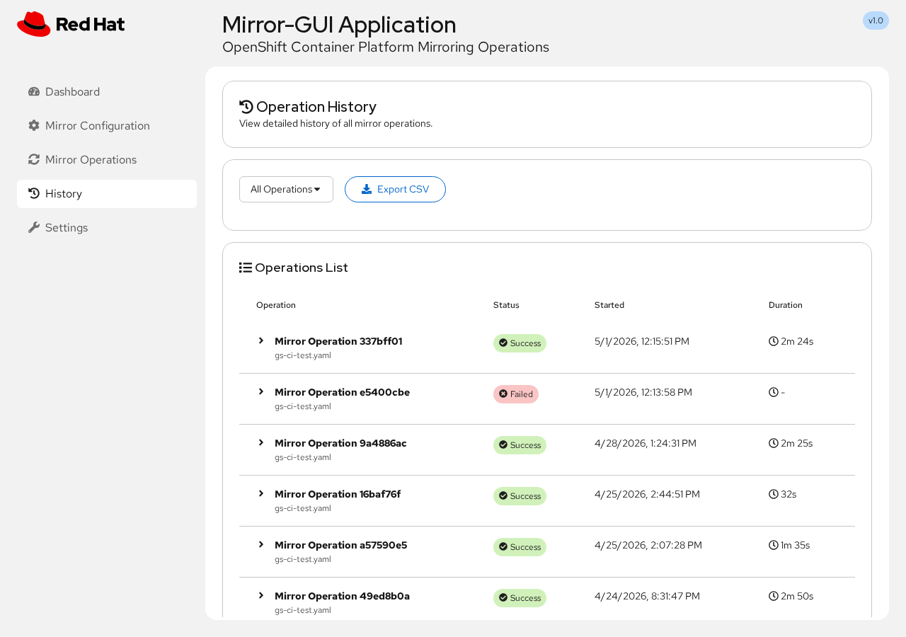
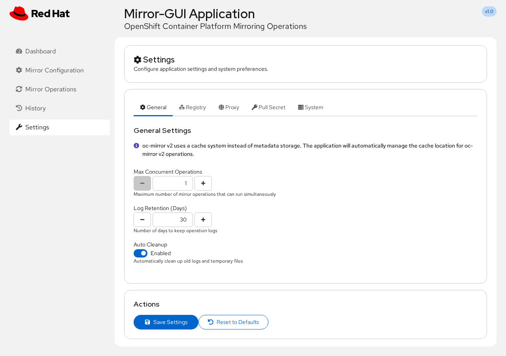

# Mirror-GUI

Mirror-GUI is a web-based interface for managing OpenShift Container Platform (OCP) mirroring operations using oc-mirror v2. It provides a visual configuration builder, operation execution with real-time monitoring, and environment management - without requiring command-line expertise.

The application runs as a containerized service (Podman) and wraps oc-mirror v2 to perform mirror-to-disk workflows. It uses pre-fetched operator catalog metadata to enable offline-capable operator browsing, channel selection, and dependency detection.

## Table of Contents

- [Mirror-GUI](#mirror-gui)
  - [Table of Contents](#table-of-contents)
  - [Getting Started](#getting-started)
    - [Prerequisites](#prerequisites)
    - [Clone the repository](#clone-the-repository)
    - [Build and run](#build-and-run)
  - [Features](#features)
    - [Dashboard](#dashboard)
    - [Mirror Configuration](#mirror-configuration)
    - [Mirror Operations](#mirror-operations)
    - [History](#history)
    - [Settings](#settings)
  - [Environment Variables](#environment-variables)
  - [Compatibility](#compatibility)
  - [Troubleshooting](#troubleshooting)
  - [API](#api)
  - [Testing](#testing)
  - [Development](#development)
    - [Architecture](#architecture)
  - [Contributing](#contributing)
  - [License](#license)

## Getting Started

### Prerequisites

- **Podman** (5.0+)
- **oc client** (for building) - download from [mirror.openshift.com](https://mirror.openshift.com/pub/openshift-v4/clients/ocp/stable/)
- **jq**, **Python 3**, and **PyYAML** — required by `sync-catalogs.sh` (`sudo dnf install -y jq python3 && pip3 install --user PyYAML`)
- **Pull secret** from [console.redhat.com](https://console.redhat.com/openshift/downloads#tool-pull-secret) - save to `pull-secret/pull-secret.json` before building, or run `podman login registry.redhat.io`

### Clone the repository

```bash
git clone https://github.com/openshift/mirror-gui.git
cd mirror-gui
```

### Build and run

```bash
# Build and run locally (fetches catalogs, builds image, starts container)
./local-build.sh

# Build only, without starting the container
./local-build.sh --build

# Run a previously built image without rebuilding or fetching catalogs
./local-build.sh --run
```

Every build path runs `sync-catalogs.sh` to pull the latest Red Hat, Certified, and Community operator catalogs (OCP 4.16–4.22) before building the image. Use `--run` to skip fetching and building when you already have a local image.

Open the URL printed by the script in your browser. By default it uses `http://localhost:3000`, but it automatically selects another free host port if `3000` is already in use. The `Web UI:` line in the script output shows the chosen address.

Manage with: `./local-build.sh --stop`, `--restart`, `--status`, `--logs`.

## Features

### Dashboard

Environment overview (oc-mirror version, environment status, pull secret status), operation statistics, recent operations, and quick action buttons. Shows a warning banner when no pull secret is detected.



**Dark theme** - Toggle between Light, Dark, and System (auto) themes from the masthead.



### Mirror Configuration

Visual configuration builder with tabs for Platform Channels, Operators, Additional Images, YAML Preview, and file upload.

- **Adding operators** - Select from pre-fetched catalogs (OCP 4.16–4.22) with Red Hat, Certified, and Community operator indexes. Automatic dependency detection with one-click add.
- **YAML preview and editing** - Preview the generated `ImageSetConfiguration` YAML, copy to clipboard, or edit directly. Set an optional archive size limit (in GiB).
- **Upload existing YAML** - Import an existing `ImageSetConfiguration` YAML file, review and edit it, then save or load it into the form editor.



### Mirror Operations

Execute mirror operations with real-time monitoring. Select a saved configuration file, optionally specify a destination subdirectory, and start the operation. View operation history with logs, location info, and delete actions.



### History

Filter and review all past operations. Export to CSV.



### Settings

Configure environment preferences across four tabs:

| Tab | Purpose |
|-----|---------|
| **Pull Secret** | View, upload, edit, or remove your pull secret |
| **Registry** | Auto-detected registries from your pull secret with authentication verification |
| **Cache** | View cache location and size, clean up cache data |
| **Sync Catalogs** | Fetch the latest operator catalog metadata from registry.redhat.io for all supported OCP versions |



## Environment Variables

| Variable | Description | Default |
|----------|-------------|---------|
| `IMAGE_NAME` | Override the container image name | `mirror-gui:latest` |
| `WEB_PORT` | Override the host port | `3000` |
| `CACHE_DIR` | Override the oc-mirror cache directory (absolute host path) | `./data/cache` |

## Compatibility

| | |
|---|---|
| **oc-mirror** | v2 |
| **OpenShift** | 4.16 – 4.22 |
| **Container runtime** | Podman 5.0+ |
| **Architecture** | AMD64 (x86_64), ARM64 (aarch64) |

## Troubleshooting

See [TROUBLESHOOTING.md](TROUBLESHOOTING.md) for common issues and solutions.

## API

Full RESTful API documentation is available in [API.md](API.md).

## Testing

Test documentation is available in [TESTS.md](TESTS.md).

To run tests locally:

```bash
npm test              # unit and integration tests (Vitest)
npm run test:coverage # tests with coverage
npm run test:e2e      # end-to-end tests (Playwright)
npm run test:all      # all tests
npm run lint          # ESLint
```

## Development

### Architecture

Mirror-GUI is a TypeScript application with two main layers:

| Layer | Technology | Purpose |
|-------|-----------|---------|
| **Frontend** | React 18, PatternFly 6, Vite | Single-page application with visual config builder |
| **Backend** | Express (Node.js 22), tsx | REST API server that wraps oc-mirror v2 CLI |

The backend spawns `oc-mirror` as a child process for mirror operations and streams logs via SSE. Operator catalog metadata is pre-fetched at build time (`sync-catalogs.sh`) and bundled into the container image for offline browsing.

For a detailed architecture overview, see [ARCHITECTURE.md](ARCHITECTURE.md). Additional developer reference docs (catalog pipeline, mirror operations lifecycle, registry auth flow) are available in [docs/dev/](docs/dev/).

## Contributing

See [CONTRIBUTING.md](CONTRIBUTING.md) for details on reporting bugs, submitting pull requests, and running tests.

## License

Apache License 2.0 - see [LICENSE](LICENSE) for details.
